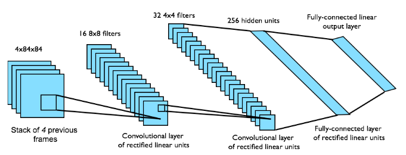
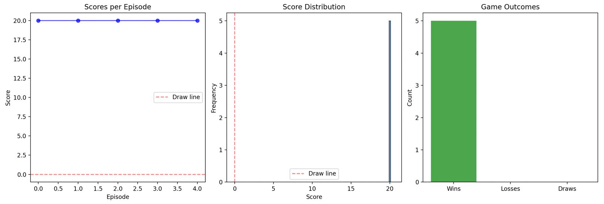

# Playing Atari with Deep Reinforcement Learning - DQN 🤖

#### Decision Making Algorithms Seminar Project 2025 - TUM

model is the right player

This project presents a complete implementation and analysis of the groundbreaking 2013 DeepMind paper ["Playing Atari with Deep Reinforcement Learning"](https://www.cs.toronto.edu/~vmnih/docs/dqn.pdf) by Mnih et al., developed as part of our seminar on Decision Making Algorithms.

The Deep Q-Network (DQN) algorithm revolutionized reinforcement learning by successfully combining deep neural networks with Q-learning, achieving super human-level performance on multiple Atari 2600 games using only raw pixel inputs and game scores.

## 📖 About the Paper

The original DQN paper introduced several key innovations that made deep reinforcement learning feasible:

* **Experience Replay**: Storing and randomly sampling past experiences to break temporal correlations and improve data efficiency
* **End-to-End Learning**: Learning directly from raw pixels to actions without manual feature engineering
* **Human-Level Performance**: First algorithm to achieve human-level control on a wide variety of Atari games

Our implementation faithfully reproduces the architecture and training methodology described in the original paper, providing both educational insights and practical demonstrations of the algorithm's capabilities.

## 🧠 How DQN Works

The DQN algorithm operates through three main components:

### 1. Environment Preprocessing 🔧
* **Frame Stacking**: Stack 4 consecutive frames to capture motion
* **Grayscale Conversion**: Convert RGB to grayscale for computational efficiency
* **Frame Skipping**: Repeat actions for 4 frames to reduce computational requirements
* **Reward Clipping**: Clip rewards to [-1, +1] for algorithm stability

### 2. Neural Network Architecture 🏗️
* **Input Processing**: 84x84x4 grayscale frames (4 frames stacked for temporal information)
* **Convolutional Layers**: Two conv layers (16 8x8, 32 4x4,) for feature extraction from raw pixels
* **Fully Connected Layers**: One fully connected layer (256 hidden units) for action-value estimation

### 3. Training Process 🔄
* **Experience Replay**: Store transitions in replay buffer, sample random minibatches for training
* **Epsilon-Greedy Exploration**: Gradually decay exploration from 100% to 1% over 1M steps

## 🎯 Project Highlights

* **Faithful Implementation**: Complete reproduction of the original DQN architecture and training methodology
* **Interactive Demos**: Real-time gameplay visualization with Q-value analysis
* **Educational Tools**: Step-by-step training process with detailed logging and visualization

## 🚀 Key Features

* **Original Architecture**: Exact replication of the 2013 DQN network architecture
* **Advanced Training**: Implementation with experience replay, target networks, and epsilon-greedy exploration
* **Multi-Game Support**: Pong, Breakout, Boxing environments with specialized preprocessing

## 📊 Results

Our DQN implementation successfully demonstrates the key findings from the original paper:

| Game | Original Paper Score | Our Implementation | Human Performance |
|------|----------------------|--------------------|-------------------|
| Pong | 20                   | 20                 | -3                |

The agent learns effective strategies including ball tracking in Pong, brick-breaking patterns in Breakout, and defensive/offensive moves in Boxing.

## 🔍 Advanced Features

### Q-Value Visualization
Real-time display of Q-values for each possible action, providing insight into the agent's decision-making process.

### Interactive Testing
Step through gameplay frame-by-frame, pause/resume, and analyze specific game states.

### Comprehensive Benchmarking
Statistical evaluation over hundreds of episodes with win/loss analysis and performance metrics.

## 🕹️ Contributors

Developed for the Seminar: Decision-Making Algorithms 2025 by:

* **Luca Bozzetti**
* **Paul Vorderbrügge**
* **Sebastian Rogg**

* **inspired by the repo of Shubham Lohiya:** https://github.com/shubhlohiya/playing-atari-with-deep-RL
